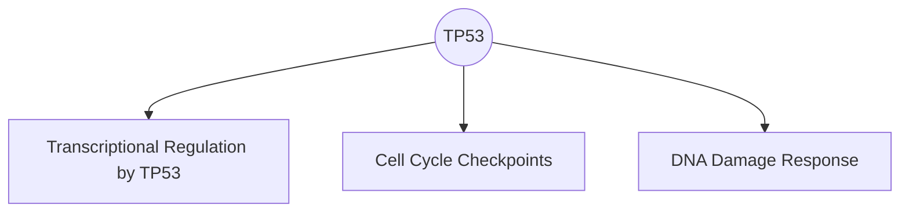

# GenomeMCP

> **AI-powered genomic intelligence through the Model Context Protocol**

[](https://www.python.org/downloads/)
[](https://modelcontextprotocol.io/)
[](https://opensource.org/licenses/MIT)
[](https://www.ncbi.nlm.nih.gov/clinvar/)
[](https://gnomad.broadinstitute.org/)
[](https://reactome.org/)

**GenomeMCP** is a research-grade **Model Context Protocol (MCP) server** that enables AI agents to query clinical genomics databases, retrieve supporting scientific literature, analyze population genetics, and visualize biological pathways — all in real-time.

---

## 🎯 Why GenomeMCP?

| Problem                           | GenomeMCP Solution                           |
| --------------------------------- | -------------------------------------------- |
| AI agents lack genomic knowledge  | Direct ClinVar, gnomAD, Reactome integration |
| No evidence for clinical claims   | Auto-retrieves PubMed abstracts              |
| Variant interpretation is complex | Population frequency + pathway context       |
| Gene-disease links are opaque     | Automatic relationship discovery             |

---

## 🧬 Features

### Core Genomics Tools

- **`search_clinvar(term)`** — Query ClinVar for genes, variants, or diseases
- **`get_variant_report(id)`** — Detailed clinical significance report
- **`get_gene_info(symbol)`** — Gene function, location, and aliases from NCBI Gene
- **`get_supporting_literature(id)`** — PubMed articles linked to a variant

### Population Genetics

- **`get_population_stats(variant)`** — Allele frequency from gnomAD (Genome Aggregation Database)

### Pathway Analysis

- **`get_pathway_info(gene)`** — Reactome biological pathways for a gene
- **`visualize_pathway(gene)`** — Generate Mermaid.js diagrams of gene-pathway relationships

### Discovery & Synthesis

- **`find_related_genes(phenotype)`** — Discover genes associated with a disease
- **`get_genomic_context(gene, position)`** — Identify exon vs intron regions
- **`get_discovery_evidence(phenotype)`** — Aggregate PubMed abstracts for AI reasoning

---

## 🚀 Quick Start

### Installation

```bash
# Clone the repository
git clone https://github.com/nexisdev/GenomeMCP.git
cd GenomeMCP

# Install dependencies with uv
uv sync

# Run the MCP server
uv run python src/main.py
```

### Claude Desktop Integration

Add to your `claude_desktop_config.json`:

```json
{
  "mcpServers": {
    "genomemcp": {
      "command": "uv",
      "args": [
        "--directory",
        "/path/to/GenomeMCP",
        "run",
        "python",
        "src/main.py"
      ]
    }
  }
}
```

---

## 📖 Usage Examples

### Search for a Gene Variant

```
User: "What variants are associated with BRCA1?"
Agent uses: search_clinvar("BRCA1")
```

### Get Population Frequency

```
User: "How common is the variant 1-55516888-G-GA?"
Agent uses: get_population_stats("1-55516888-G-GA")
→ Returns gnomAD allele frequency: 0.000123 (0.01%)
```

### Discover Gene-Disease Relationships

```
User: "What genes are linked to Lynch Syndrome?"
Agent uses: find_related_genes("Lynch Syndrome")
→ Returns: MSH2 (12 variants), MLH1 (8 variants), PMS2 (5 variants)
```

### Visualize Pathways

```
User: "Show me the pathways for TP53"
Agent uses: visualize_pathway("TP53")
→ Returns Mermaid diagram:
```



---

## 🔬 Data Sources

| Source                                           | Description                      | API                      |
| ------------------------------------------------ | -------------------------------- | ------------------------ |
| [ClinVar](https://www.ncbi.nlm.nih.gov/clinvar/) | Clinical variant interpretations | NCBI E-utilities         |
| [gnomAD](https://gnomad.broadinstitute.org/)     | Population allele frequencies    | gnomAD GraphQL           |
| [Reactome](https://reactome.org/)                | Biological pathway database      | Reactome Content Service |
| [PubMed](https://pubmed.ncbi.nlm.nih.gov/)       | Scientific literature            | NCBI E-utilities         |
| [NCBI Gene](https://www.ncbi.nlm.nih.gov/gene/)  | Gene annotations                 | NCBI E-utilities         |

---

## 🏗️ Architecture

```
GenomeMCP/
├── src/
│   ├── main.py          # MCP server & tool definitions
│   ├── clinvar.py       # ClinVar & PubMed API client
│   ├── genomics.py      # Exon/Intron mapping
│   ├── population.py    # gnomAD integration
│   ├── pathways.py      # Reactome integration
│   └── utils.py         # Shared utilities
├── tests/               # Unit tests
├── docs/                # Documentation
└── pyproject.toml       # Project configuration
```

---

## 🧪 Testing

```bash
# Run all tests
uv run pytest

# Run specific test suite
uv run pytest tests/test_phase4.py tests/test_phase5.py
```

---

## 📚 Documentation

- [Tool Reference](docs/tool_reference.md) — Complete API documentation
- [Architecture Guide](docs/architecture_and_capabilities.md) — System design

---

## 🤝 Contributing

Contributions are welcome! Please open an issue or submit a pull request.

---

## 📄 License

MIT License — see [LICENSE](LICENSE) for details.

---

## 🔗 Keywords

`genomics` `bioinformatics` `clinvar` `gnomad` `mcp` `model-context-protocol` `ai-agent` `claude` `variant-interpretation` `population-genetics` `reactome` `pathway-analysis` `pubmed` `ncbi` `gene-discovery` `clinical-genomics` `precision-medicine` `llm-tools`

---

<p align="center">
  <strong>Built for AI agents. Powered by open genomic data.</strong>
</p>
