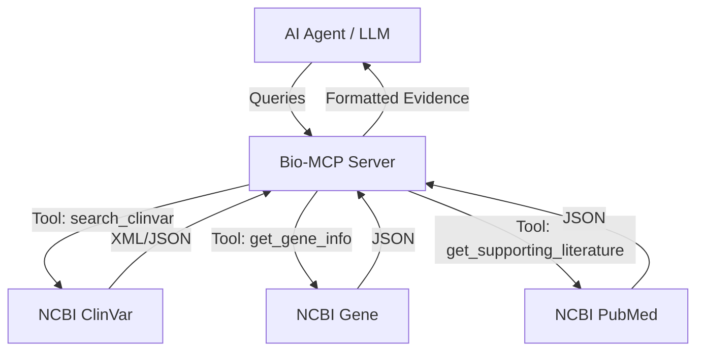

# Bio-MCP ClinVar Server: Architecture & Capabilities

## 1. Overview

The **Bio-MCP ClinVar Server** is an intelligent agent tool designed to bridge Large Language Models (LLMs) with high-fidelity genomic data from the NCBI ClinVar database. Unlike simple search tools, it implements a "Research-Grade" retrieval pipeline that fetches not just raw data but also the biological context and scientific evidence required for high-stakes decision-making.

## 2. Architecture

The system is built on the **Model Context Protocol (MCP)** and integrates with NCBI E-utilities via a robust, rate-limited Python client.

## 3. Core Features

### A. Phenotype-Aware Discovery

- **Tool**: `search_clinvar(term)`
- **Capability**: Finds variants not just by gene symbol (e.g., "BRCA1") but also by disease name (e.g., "Cystic Fibrosis").
- **Output**: Returns a list of variants with:
  - ClinVar Accession (VCV)
  - Clinical Significance (Pathogenic, Benign, Likely Oncogenic)
  - Review Status

### B. Deep Evidence Retrieval (The "Why")

- **Tool**: `get_supporting_literature(variant_id)`
- **Capability**: Retrieves the specific scientific papers (PubMed IDs) that were used to classify a variant.
- **Output**: Returns citation details (Title, Journal, Authors, Date) to allow the agent to verify claims.
- **Configurable Depth**: Supports `max_results` parameter to control the volume of literature retrieved, preventing context bloat while allowing deep dives.

### C. Biological Context (The "How")

- **Tools**: `get_gene_info`, `get_pathway_info`
- **Capability**: Links genes to function and molecular pathways.
- **Data Sources**: NCBI Gene, Reactome.

### D. Population Genetics (The "Where")

- **Tool**: `get_population_stats`
- **Capability**: Provides allele frequency data to contextualize variant rarity.
- **Data Source**: gnomAD (Genome Aggregation Database).

## 4. Use Cases

1.  **Variant Interpretation**: An oncologist asks "Is the BAP1 variant c.438-16_443del pathogenic?" -> Agent checks ClinVar and cites the specific study classifying it as "Likely Oncogenic".
2.  **Gene Research**: A researcher encounters "TP53" in a report -> Agent retrieves its role as a "tumor suppressor" and its chromosomal location.
3.  **Literature Mining**: An automated pipeline queries finding supporting evidence for all "Uncertain Significance" variants in a patient cohort.

## 5. Technical Specifications

- **Stack**: Python 3.10+, `mcp` SDK, `httpx`, `xmltodict`.
- **Reliability**: Implements exponential backoff for `429 Too Many Requests` handling from NCBI.
- **Performance**: Asynchronous I/O with optimized timeouts (30s) for slow public APIs.
